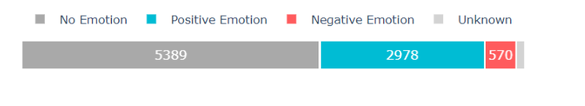
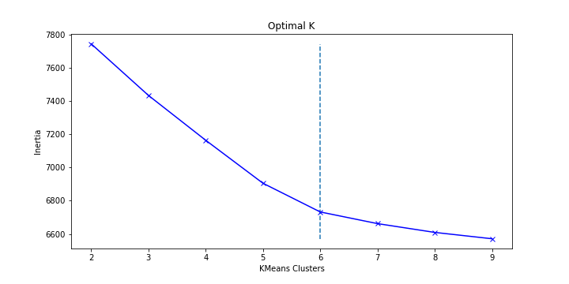
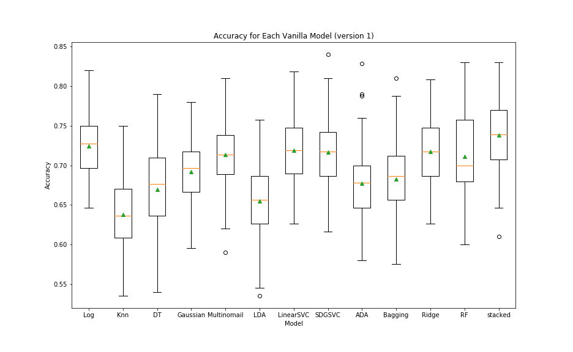
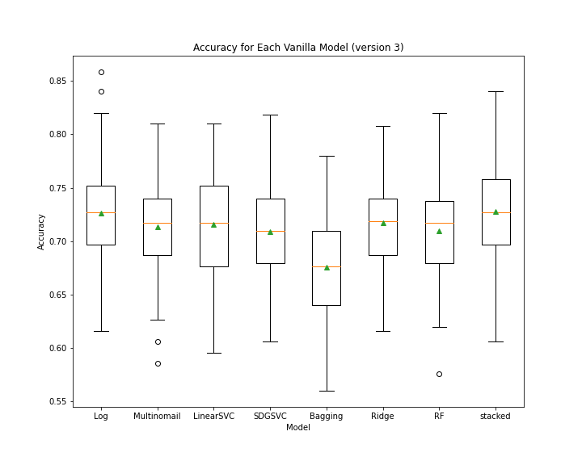
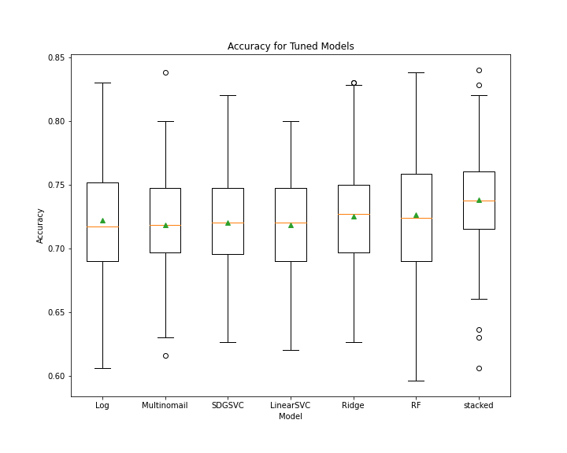
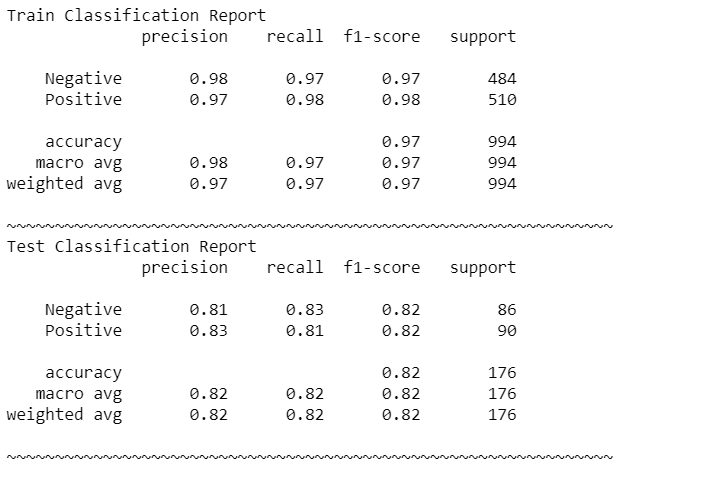
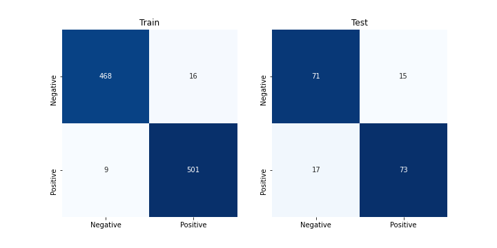
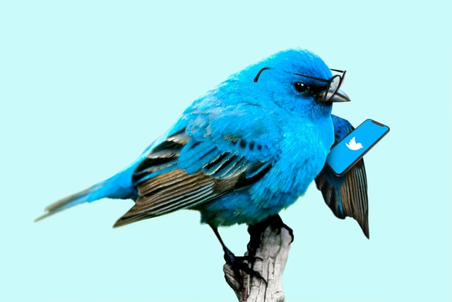

# Twitter_Sentiment_Analysis

## Contributers 
- Samuel Mohebban
  - Samuel.MohebbanJob@gmail.com
  - [LinkedIn](https://www.linkedin.com/in/samuel-mohebban-b50732139/) 
  - [Medium](https://medium.com/@HeeebsInc)
- Raven Welch
  - email 
  - [LinkedIn](https://www.linkedin.com/in/raven-welch/)
  - [Medium]()

[Google Slide Presentation](https://docs.google.com/presentation/d/15voSS3ctPLzh_cXnql9N3kaXL4PJ-3-6xRGRzFsgyzc/edit?usp=sharing)
### Problem 
- Ideally, customers are always satisfied with a company's services, however, this is rarely the case 
- Twitter is a cornerstrone for communication as many customers share their issues on the platform.  For customers, Twitter is accessible and can offer ways for a customer to directly communicate with larger companies such as Google and Apple
- Manually screening each tweet can be costly and time consuming 

### Solution 
- We wanted to create a Machine Learning algorithm that can correctly detect sentiment within tweets.  
- By accomplishing this, a company can better screen customer feedback and attend to any issues they may be having 

### Data 
- [Brands and Product Emotion Dataset](https://data.world/crowdflower/brands-and-product-emotions)
- Comprised of 9000 tweets regarding sentiment towards Apple and Google Products 
- Gathered in August 2013
- Removed 'No Emotion' and 'Unknown' 
- Data was pruned to 600 Positive Tweets and 570 Negative Tweets so that our final dataset had an equal class balance for each target

### Data Cleaning 
1. Cleaned the data to remove the following: 
    - names
    - usernames
    - non-alphabetical characters
    - and stop words such as “so”, “a”, and “we”
2. Stemmed each word within our data
    - Ex: “Likes”, “Liked”, “Likely”, “Liking” all become “Like”
3. Applied KMeans clustering with n_clusters = 6 
4. Split into Training and Test sets for modeling 
      - **Train** → 994 (50% Positive, 50% Negative) 
      - **Test** → 176 (50% Positive, 50% Negative)
- [code](https://github.com/HeeebsInc/Google_Apple_Sentiment_Analysis/blob/master/Functions.py#L148)

### KMeans Clustering 

- Using Sum of Square differences, we found the optimal cluster size to be equal to 6 
- We then used PCA dimension reduction to reduce our values onto a 3-demensional plane in order to create the visualization below 
-  [code](ClusterViz.ipynb) for 3D plot

### Modeling 
- Our base model is a stacked classifier 
- Initially, we tried various models and tested each alone, and together within a stacked classifier 
- We then iterated 3 times, each time pruning the least accurate models in order to increase the accuracy of our stacked classifier 
- For each run, we used SKlearn's RepeatedStratifiedKFold to compare each model's accuracy.  
#### Test 1
- After the first test, we pruned KNN, DecisionTree, and LDA.  These models all had a majority of scores lower than 75% and very wide ranges

#### Test 2
- After the second test, we then pruned ADA, Bagging, and Gaussian classifier due to their wide ranges and low accuracies

#### Test 3
- Finally, we pruned only the Bagging Classifier, leaving us with LogisticRegression, MultinomialNB, LinearSVC, SDGSVC, RidgeClassifier, and RandomForestClassifier
- Although the stacked classifier did not perform much better than other classifiers alone, the range was tighter and provided more consistent predictions

### Tuned Stacked Classifier 
- For each model mentioned above, we tuned the hyperparameters than repeated the RepeatedStratifiedKFold 
- Again, we see that the stacked classifier did not perform much better than the other classifiers alone, but there was evidence of a tighter range and thus more consistent predictions
- The stacked classifier was chosen as the final model because Stacked Classifiers improve with variation.  Although we see in our example that it did not do much better, with the inclusion of more data that is unknown is might perform better than the latter.  

#### Classification Report 
 

#### Confusion Matrix 

